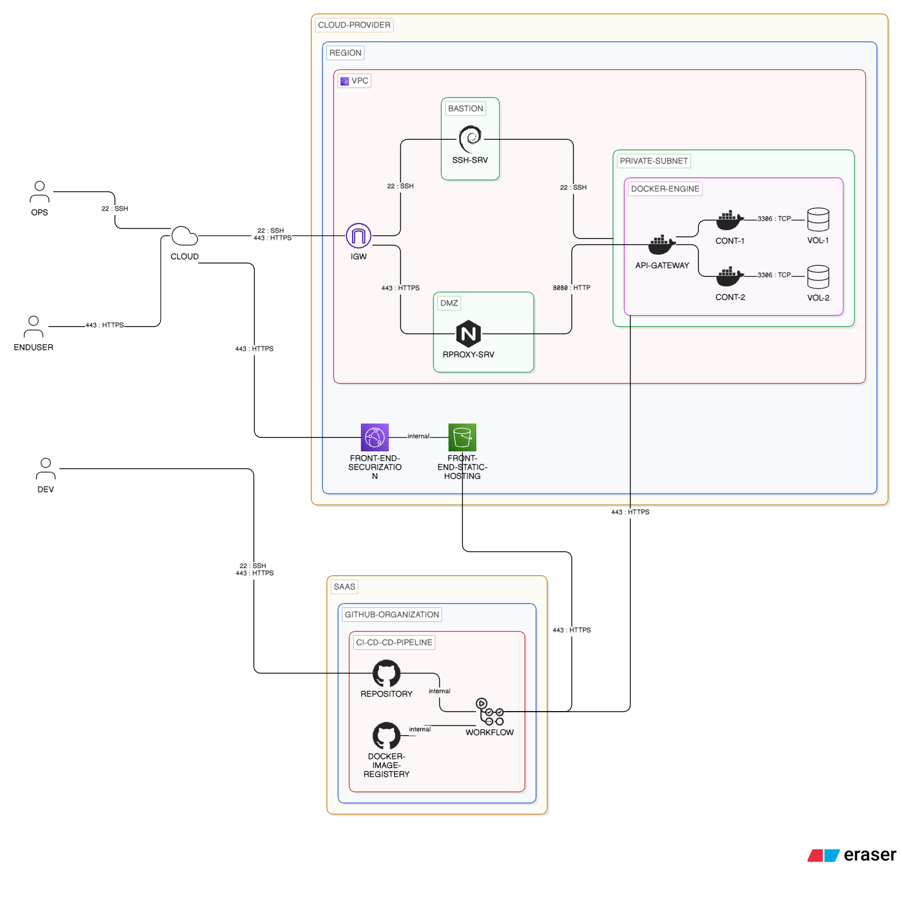

# PROJ LABE LAFE

## Intention

Cette infrastructure est mise en place dans le cadre d'un projet de fin d'étude en Ecole Supérieure.

Il s'agit d'un environnement de "stage" à des fins d'entraînement et de validation des compétences DEVOPS.

## Schéma

|Critère|Valeur|Détail|
|:--|:--|:--|
|VPC - IP RANGE|10.0.0.0/16||
|RPROXY SRV - FQDN|'<your-app>'.cld.education||
|SUBNET IP RANGE|10.0.0.0/28||

* Private Subnet

|Critère|Valeur|Détail|
|:--|:--|:--|
|IP RANGE|10.0.X.0/28|X = team number|
|SUBNET DOKER ENGINE - IP|10.0.X.10/28||

## Dod

"A CI/CD pipeline is considered “done” when it reliably, securely, and automatically takes code from commit to production with full traceability and minimal manual intervention."

This DOD is phased. It should be implemented in incremental steps. Here are the steps to follow, in order of priority, to build a robust pipeline.

1. Source Control & Triggering

- All code is versioned in a central organization
   - [ ] Backend and Frontend are splitted in different repo, having our own dev lifecycle
-  Pipeline triggers automatically on:
   - [ ] Merge on main
   - [ ] Merge on hotfix/*
   - [ ] Merge on release/*
   - [ ] Merge on develop/*
   - [ ] Merge on feature/*

- Branching strategy is clearly defined and enforced (readme and configuration)

2. Automated testing

- [ ] Unit tests executed for both frontend and backend (inside container)
- [ ] Integration test run for Spring services
- [ ] Minimum coverage threshold enforced (=> 80%)
- [ ] Pipeline fails on test failure

- [ ] End-to-end tests are optionnal

3. Build stage

- Frontend (Vue.js)
  - [ ] Dependencies installed reproducibly (package-lock.json / yarn.lock)
  - [ ] Application builds successfully (npm run build)
  - [ ] Build ready for stagging are tagged "stage" and are available on the organization "package"

- Backend (Spring Boot)
  - [ ] Project builds successfully (e.g., mvn clean package)
  - [ ] Docker image artifact generated
  - [ ] Build ready for stagging are tagged "stage" and are available on the organization "package"

4. Code Quality && Security

- [ ] Linting enforced for both frontend and backend
- [ ] Dependency vulnerability scanning included
- [ ] No critical/high vulnerabilities allowed to pass

5. Containerization

- [ ] Docker image build using consistent Dockerfiles
- [ ] Images tagged with:
      - [ ] commit SHA
      - [ ] version
      - [ ] dev for internal testing
      - [ ] stage ready for deployment
- [ ] Images pushed to the organization registry

6. Deployment

Frontend
* Vue build deployed on AWS S3
* CDN cache invalidated via AWS CloudFront
* Routing fallback configured correctly

Backend
* Containers deployed to target environments (own Docker Engine Host)
* Health checks pass before marking deployment successful

### Environment Management

* Separate environments exist:
  * dev
  * stage
---
Optionnel

### Rollback Strategy

* Ability to rollback to a previous stable version:
* Backend → previous Docker image
* Frontend → previous S3 artifact version
* Rollback process is documented and tested
 
### Observability & Feedback

* Deployment status visible in pipeline dashboard
* Logs accessible for all stages
* Alerts configured for failures
* Basic monitoring in place post-deploy

## Bibliographie

* [DevOps Handbook](https://ebooks.karbust.me/Technology/The%20DevOps%20Handbook%20How%20to%20Create%20World-Class%20Agility,%20Reliability,%20and%20Security%20in%20Technology%20Organizations%20by%20Gene%20Kim,%20Jez%20Humble,%20Patrick%20Debois,%20John%20Willis.pdf)

###
